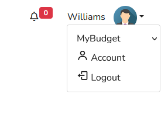

### Budgets 🐷

You can manage your budgets through [http://127.0.0.1/budget](http://127.0.0.1/budget) or by navigating to the `Budget` section in the menu.

#### 1. Creating

To create a new budget, simply specify a name and choose the currency. Currently, only USD and EUR are available as currency options, but additional currencies and languages will be supported in the future.

#### 2. Modifying

Easily modify your budget by clicking the green `Edit Budget` button, where you can adjust the name and currency.

#### 3. Sharing

Collaborate on budgets by using the grey `Share Budget` button to grant access to other registered Piglet users.

#### 4. Leaving 

If you need to leave a budget, use the red button. Keep in mind that if you're the last user to leave a budget, all associated orders and categories will be deleted.

#### 5. Changing the Currently Active Budget 

If you have multiple budgets associated with your user account, you can switch between them by selecting the desired budget from the dropdown menu located near your username.
