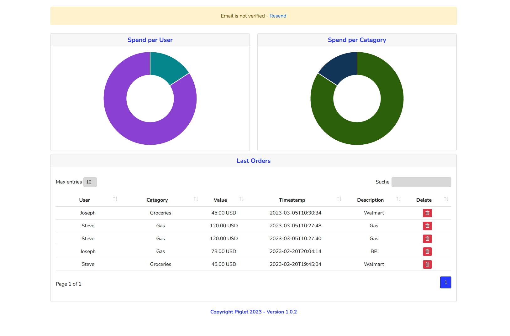

# piglet :pig:
[](https://github.com/k3nd0x/piglet/actions/workflows/docker-build_push.yml)

A simple Webapp to manage and budgets in a household. \
It comes with an lightweight webinterface and an api.
You can easily add, categorize and compare your expenditures, individualize your categories and profile. 



# Features
📌 Privacy and Security: Keep your financial data safe on your server.

💵 Expense Tracking: Easily record and categorize expenses to understand your spending habits.

🔄 Budget Sharing: Collaborate with family or friends by sharing budgets

📅 Monthly Reports: Get detailed reports to track your financial progress over time.

🔐 Secure Authentication: Protect your data with secure user authentication.

# Installation
#### With Docker
The Image is available at `k3nd0x/piglet`. \
All relevant webapp data is in the container image.

The mariadb image is the official image from the MariaDB Foundation. \
To keep the data consistent you only have to store the mariadb data (`/var/lib/mysql`) locally. (See volume config in docker-compose file) \
In the `.env` file you have to set our private data like mysql_password and mysql_user. 

You can use the `docker-compose.yml` to create both containers: `docker-compose up`

At the first startup a database will be created with the data from the `.env` file and some default data will be imported.
```
version: '3.3'
services:
    piglet:
      restart: unless-stopped
      container_name: piglet
      depends_on:
        - database
      ports:
        - '0.0.0.0:80:80' # Piglet
        - '0.0.0.0:8080:8080' # API
      image: k3nd0x/piglet:latest
      environment:
        MYSQL_DATABASE: ${MYSQL_DATABASE} # Default 'piglet'
        MYSQL_USER: ${MYSQL_USER} # Default 'piglet'
        MYSQL_PASSWORD: ${MYSQL_PASSWORD}
        MYSQL_HOST: ${MYSQL_HOST}
        MAIL_SERVER: ${MAIL_SERVER}
        MAIL_USER: ${MAIL_USER}
        MAIL_PASSWORD: ${MAIL_PASSWORD}
        MAIL_PORT: ${MAIL_PORT}
        MAIL_ENCRYPTIONPROTOCOL: ${MAIL_ENCRYPTIONPROTOCOL}
        DOMAIN: ${DOMAIN} # Default 'localhost'
      volumes:
        - "/etc/timezone:/etc/timezone:ro"
        - "/etc/localtime:/etc/localtime:ro"
    database:
      image: mariadb:latest
      container_name: piglet-db
      volumes:
        - database-data:/var/lib/mysql
      environment:
        MYSQL_RANDOM_ROOT_PASSWORD: 1
        MYSQL_DATABASE: ${MYSQL_DATABASE}
        MYSQL_USER: ${MYSQL_USER}
        MYSQL_PASSWORD: ${MYSQL_PASSWORD}
volumes:
  database-data:
```

Default login 
Username: `admin@$DOMAIN`
Password: `admin`


Following ENV variables are possible:
| ENV variable  | description | defaults | required |
| -- | -- | -- | -- |
| MYSQL_USER  | User for the piglet database | piglet | :x:
| MYSQL_DATABASE  | Name of the piglet database | piglet | :x:
| MYSQL_HOST | Hostname or IP Address of the databasehost | database | :x:
| MYSQL_PASSWORD | Password for the piglet database user | None | :white_check_mark:
| DOMAIN | Default domain of the piglet instance | localhost | :x:
| MAIL_SERVER | Mailserver for email notification | None | :x:
| MAIL_PORT | Mailserver Port | None | :x:
| MAIL_USER | Mailserver User | None | :x:
| MAIL_PASSWORD | Mailserver Password | None | :x:
| MAIL_ENCRYPTIONPROTOCOL | Mailserver Encryption Protocol | None | :x:
| SECURE_COOKIE | Setting to allow login over http | False | :x:

*The Mail sending process is currently in beta state

# Roadmap
- support for different languages
- few admin settings in the webui (e.g. mailserver config)
- html/css mobile friendly
- add some more features to reports
- password change over webui

# Known issues
- Site is flashing white at reload when darkmode is active https://github.com/k3nd0x/piglet/issues/1
- Nav Menue is popping out at reload when its in mini mode https://github.com/k3nd0x/piglet/issues/2

# Disclaimer

I started to build this project at the beginning of my programming career so please be gentle if something is not working as expected.
Feel free to edit or just open a issue. Feature requests can also be added at the issue tab.

Currently "unsecure cookie setting" is activated to allow a login over http per default.
If you want to access your piglet instance over the internet I highly recommend to access the site over a reverse proxy with https.
If you accessing the piglet instance over https please disable "unsecure cookie setting". Just set the env var `SECURE_COOKIE` to True (default: False).
